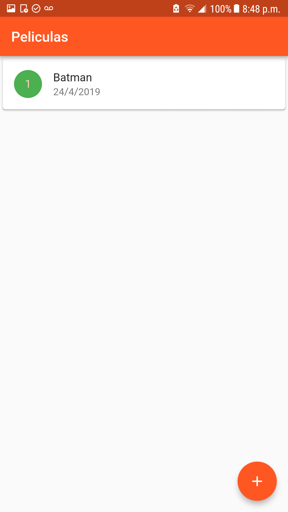
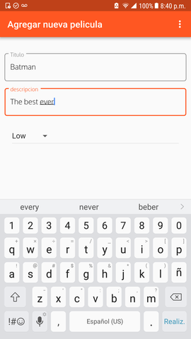

# CRUD Movies App

This is a simple CRUD movie android APP with Flutter using SQFLITE and Internationalization
with Flutter

This code might help beginner developers willing to learn how to use
the SQFLITE, Internationalization(English and Spanish at this moment)
and adding customize Fonts with Flutter

This project is a starting point for a Flutter application.

### Flutter libraries used in this project
* flutter_localizations
* sqflite
* path_provider
* intl
* intl_translation

### Prerequisites
* Follow this step by step for installing Flutter: - [Installing Flutter](https://flutter.dev/docs/get-started/install)

## Getting Started

1- Clone repository

```
git clone https://github.com/franchyreyes/simpleCRUD-flutter-app
```

2- Using the Dart intl tools

With the app’s root directory as the current directory and run this code in the console
```
flutter packages pub run intl_translation:generate_from_arb  --output-dir=lib/l10n --no-use-deferred-loading  lib/l10n/intl_en.arb lib/l10n/intl_es.arb lib/locale/locales.dart
```
Note: references [internazionalization]https://flutter.dev/docs/development/accessibility-and-localization/internationalization

3- Start using

Connect your device on the machine and run, or run on the emulator

## Screen





## License

[Flutter license](https://github.com/flutter/flutter/blob/master/LICENSE)

Note: This code has only been tested in the Android environment

Any question feel free to contact me at franchyreyes@hotmail.com


